# Availability Archetype

## General Problem Statement

### Level 1

One of the most common challenges in software development is building systems that can ensure exclusive access. It's very likely you've already faced that problem - for example, by building a car rental system that had to prevent customers from double-booking the same vehicle, or an event ticketing platform where multiple users try to purchase the last available seat simultaneously

### Level 2

Such systems must also handle scenarios where resources can't be reserved due to their current state. For instance, a car might be unavailable for booking not because it's already reserved, but because it's undergoing maintenance due to a malfunction, or because it's currently being relocated between different locations

### Level 3

The complexity deepens when considering state transitions - resources cannot simply move between states without validation. For example, a car cannot be moved to maintenance mode if it currently has an active reservation, and it cannot be withdrawn from service if it's already undergoing maintenance or has existing bookings. And obviously, reservations cannot be created when a resource is in maintenance or withdrawn mode

## Possible Solutions

### Begin with car model

If we take the requirements literally, we might model those scenarios directly in the Car with boolean flags:

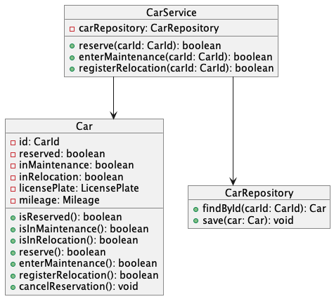

```java
class Car {
    private CarId id;
    private boolean reserved;
    private boolean inMaintenance;
    private boolean inRelocation;
    private LicensePlate licensePlate;
    private Mileage mileage;
    // more car related properties

    boolean isReserved() {
        return reserved;
    }

    boolean isInMaintenance() {
        return inMaintenance;
    }

    boolean isInRelocation() {
        return inRelocation;
    }

    boolean reserve() {
        //
    }

    boolean enterMaintenance() {
        //
    }

    boolean registerRelocation() {
        //
    }

    void cancelReservation() {
        this.reserved = false;
    }
}
```

```java
class CarService {
    private final CarRepository carRepository;

    CarService(CarRepository carRepository) {
        this.carRepository = carRepository;
    }

    boolean reserve(CarId carId) {
        Car car = carRepository.findById(carId);

        if(car.reserve()) {
            carRepository.save(car);
            return true;
        }

        return false;
    }

    boolean enterMaintenance(CarId carId) {
        //
    }

    boolean registerRelocation(CarId carId) {
        //
    }
}
```

However, this approach has several problems: Car mixes unrelated concerns. On one side reservations, maintenance, relocation and on the other licensePlate, mileage and other stuff. Also we lose critical information - a single boolean flag is not enough to determine who reserved or for when - to store this information we need to add even more properties unrelated to Car.

Let's instead treat reservation, maintenance and relocation as separate models:

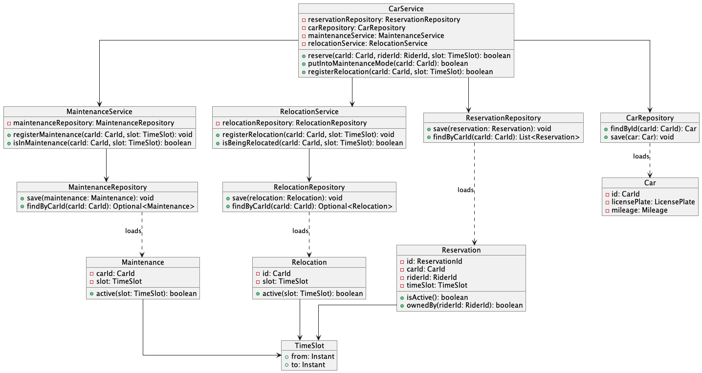

```java
class Reservation {
    private ReservationId id;
    private CarId carId;
    private RiderId riderId;
    private TimeSlot timeSlot;

    Reservation(CarId carId, RiderId riderId, TimeSlot timeSlot) {
        this.id = ReservationId.newOne();
        this.carId = carId;
        this.riderId = riderId;
        this.timeSlot = timeSlot;
    }

    boolean isActive() {
        return Instant.now().isAfter(timeSlot.from()) && Instant.now().isBefore(timeSlot.to());
    }

    boolean ownedBy(RiderId riderId) {
        return this.riderId.equals(riderId);
    }
}

class CarService {
    private final ReservationRepository reservationRepository;

    CarService(ReservationRepository reservationRepository) {
        this.reservationRepository = reservationRepository;
    }

    boolean reserve(CarId carId, RiderId riderId, TimeSlot slot) {
        if(isReserved(carId, slot)) {
            return false;
        }
        reservationRepository.save(new Reservation(carId, riderId, slot));
        return true;
    }

    private boolean isReserved(CarId carId, TimeSlot slot) {
        // ..
    }
}
```

And it works as we expect, but that is not everything. Now we need to implement logic related to maintenance.

```java
class Maintenance {
    private CarId carId;
    private TimeSlot slot;

    Maintenance(CarId carId, TimeSlot slot) {
        this.carId = carId;
        this.slot = slot;
    }

    boolean active(TimeSlot slot) {
        return this.slot.overlapsWith(slot);
    }
}

class MaintenanceService {
    private MaintenanceRepository maintenanceRepository;

    MaintenanceService(MaintenanceRepository maintenanceRepository) {
        this.maintenanceRepository = maintenanceRepository;
    }

    void registerMaintenance(CarId carId, TimeSlot slot) {
        maintenanceRepository.save(new Maintenance(carId, slot));
    }

    boolean isInMaintenance(CarId carId, TimeSlot slot) {
        Optional<Maintenance> maintenance = maintenanceRepository.findByCarId(carId);
        if(maintenance.isEmpty()) {
            return false;
        }
        return maintenance.get().active(slot);
    }
}
```

And add new methods in our service

```java
class CarService {
    private final ReservationRepository reservationRepository;
    private final CarRepository carRepository;
    private final MaintenanceService maintenanceService;

    CarService(ReservationRepository reservationRepository,CarRepository carRepository, MaintenanceService maintenanceService) {
        this.reservationRepository = reservationRepository;
        this.carRepository = carRepository;
        this.maintenanceService = maintenanceService;
    }

    // ...

    boolean putIntoMaintenanceMode(CarId carId, TimeSlot slot) {
        if(isReserved(carId, timeSlot)) {
            return false;
        }

        maintenanceService.registerMaintenance(carId, slot);

        return true;
    }

    private boolean isReserved(CarId carId, TimeSlot slot) {
        // ..
    }
}
```

But as we mentioned earlier, we also should not allow to reserve cars, which are in maintenance mode, so our class looks that:

```java
class CarService {
    private final ReservationRepository reservationRepository;
    private final CarRepository carRepository;
    private final MaintenanceService maintenanceService;


    CarService(ReservationRepository reservationRepository,
                        CarRepository carRepository,
                        MaintenanceService maintenanceService) {
        this.reservationRepository = reservationRepository;
        this.carRepository = carRepository;
        this.maintenanceService = maintenanceService
    }

     boolean reserve(CarId carId, RiderId riderId, TimeSlot slot) {
        if(isReserved(carId, slot)) {
            return false;
        }
        if(isInMaintenanceMode(carId)) {
            return false;
        }
        reservationRepository.save(new Reservation(carId, riderId, slot));
        return true;
    }

    boolean putIntoMaintenanceMode(CarId carId, TimeSlot slot) {
        if(isReserved(carId, timeSlot)) {
            return false;
        }

        maintenanceService.registerMaintenance(carId, slot);

        return true;
    }

    private boolean isInMaintenanceMode(CarId car) {
        // ..
    }

    private boolean isReserved(CarId carId, TimeSlot slot) {
        // ..
    }
}
```

Now let's extend our system to handle the relocation scenario. Cars need to be moved between locations, and during transit they shouldn't be available for reservations.

```java
class Relocation {
    private CarId id;
    private TimeSlot slot;

    Relocation(CarId id, TimeSlot slot) {
        this.id = id;
        this.slot = slot;
    }

    boolean active(TimeSlot slot) {
        return this.slot.overlapsWith(slot);
    }
}

class RelocationService {
    private RelocationRepository relocationRepository;

    RelocationService(RelocationRepository relocationRepository) {
        this.relocationRepository = relocationRepository;
    }

    void registerRelocation(CarId carId, TimeSlot slot) {
        relocationRepository.save(new Relocation(carId, slot));
    }

    boolean isBeingRelocated(CarId carId, TimeSlot slot) {
        Optional<Relocation> relocation = relocationRepository.findByCarId(carId);
        if(relocation.isEmpty()) {
            return false;
        }
        return relocation.get().active(slot);
    }
}
```

We also need to get into consideration relocations in CarService:

```java
class CarService {
    private final ReservationRepository reservationRepository;
    private final MaintenanceService maintenanceService;
    private final CarRepository carRepository;
    private final RelocationService relocationService;

    CarService(ReservationRepository reservationRepository,
                        CarRepository carRepository,
                        RelocationService relocationService,
                        MaintenanceService maintenanceService) {
        this.reservationRepository = reservationRepository;
        this.carRepository = carRepository;
        this.relocationService = relocationService;
        this.maintenanceService = maintenanceService
    }

    boolean registerRelocation(CarId carId, TimeSlot slot) {
         if(isReserved(carId, slot)) {
            return false;
        }
        if(isInMaintenanceMode(carId)) {
            return false;
        }

        relocationService.registerRelocation(carId, slot);
        return true;
    }

    boolean reserve(CarId carId, RiderId riderId, TimeSlot slot) {
        if(isReserved(carId, slot)) {
            return false;
        }
        if(isInMaintenanceMode(carId)) {
            return false;
        }
        if(relocationService.isBeingRelocated(carId, slot)) {
            return false;
        }
        reservationRepository.save(new Reservation(carId, riderId, slot));
        return true;
    }

    boolean putIntoMaintenanceMode(CarId carId) {
        TimeSlot slot = new TimeSlot(Instant.now(), Instant.MAX);

        if(isReserved(carId, slot)) {
            return false;
        }
        if(relocationService.isBeingRelocated(carId, slot)) {
            return false;
        }

        maintenanceService.registerMaintenance(carId, slot);

        return true;
    }

    private boolean isReserved(CarId carId, TimeSlot slot) {
        // ..
    }

    private boolean isInMaintenanceMode(CarId carId) {
        // ..
    }
}
```

Looking at this code evolution, we can see how quickly complexity spirals out of control. Adding just one more analogous blocking condition would result in 13 total validation checks across all methods, and another one after that would push it to 21 - each new business rule creates a multiplicative effect that developers must track and implement consistently. This creates cognitive overload where maintainers must remember an ever-growing matrix of interdependent state validations, leading to inevitable bugs when someone forgets to add just one check in one of the methods.
This approach scatters what is fundamentally the same business logic - determining temporal availability - across multiple services and methods. While distributing business logic across modules is appropriate when those modules represent genuinely different concerns, in this case we're duplicating the same logic in different places rather than recognizing it as a single cohesive concept. This makes it very problematic to maintain data integrity as there's no single source of truth. Testing becomes exponentially more complex as you need to verify not just individual conditions, but all possible combinations of states, making the tests fragile and difficult to maintain when business rules change.

The solution here is to stop coupling to implementation details and instead create a generic model focused on observable behavior - rather than caring about specific reasons why something is unavailable (maintenance, relocation, reservations), we should model the stable abstraction of "temporal availability" and let all these different concerns influence that single behavioral contract, achieving information hiding where clients only depend on the stable question "are you available?" rather than the volatile implementation details underneath

So let's start with the first solution that treats availability in generic way - by implementing a calendar-based model.

### Calendar


```java
class Calendar {
    List<ResourceBlockade> blockades;

    boolean block(ResourceId resourceId, TimeSlot timeSlot, Owner owner) {
        // ...
    }

    boolean release(ResourceId resourceId, TimeSlot timeSlot, Owner owner) {
        // ...
    }
}

record ResourceBlockade(ResourceId resource, TimeSlot timeSlot, Owner owner) {}

class AvailabilityFacade {
    // ..

    boolean block(ResourceId resourceId, TimeSlot timeSlot, Owner owner) {
        Calendar calendar = loadCalendar();
        return calendar.block(resourceId, timeSlot, owner);
    }

    boolean release(ResourceId resourceId, TimeSlot timeSlot, Owner owner) {
        Calendar calendar = loadCalendar();
        return calendar.release(resourceId, timeSlot, owner);
    }

    private Calendar loadCalendar() {
        // ..
    }
}
```

And check how our CarService has simplified:

```java
class CarService {
    private final ReservationRepository reservationRepository;
    private final CarRepository carRepository;
    private final RelocationService relocationService;
    private final MaintenanceService maintenanceService;
    private final AvailabilityFacade availabilityFacade;

    CarService(ReservationRepository reservationRepository,
                        CarRepository carRepository,
                        RelocationService relocationService,
                        MaintenanceService maintenanceService,
                        AvailabilityFacade availabilityFacade) {
        this.reservationRepository = reservationRepository;
        this.carRepository = carRepository;
        this.relocationService = relocationService;
        this.maintenanceService = maintenanceService;
        this.availabilityFacade = availabilityFacade;
    }

    boolean registerRelocation(CarId carId, TimeSlot slot) {
        if(availabilityFacade.block(ResourceId.of(carId.toString()), slot, Owner.of("RELOCATION"))) {
            relocationService.registerRelocation(carId, slot);
            return true;
        }

        return false;
    }

    boolean reserve(CarId carId, RiderId riderId, TimeSlot slot) {
        if(availabilityFacade.block(ResourceId.of(carId.toString()), slot, Owner.of(riderId.toString()))) {
            reservationRepository.save(new Reservation(carId, riderId, slot));
            return true;
        }

        return false;
    }

    boolean putIntoMaintenanceMode(CarId carId) {
        TimeSlot timeSlot = new TimeSlot(Instant.now(), Instant.MAX);

        if(availabilityFacade.block(ResourceId.of(carId.toString()), timeSlot, Owner.of("MAINTENANCE"))) {
            maintenanceService.registerMaintenance(carId, slot);
            return true;
        }

        return false;
    }
}
```

We now have only one if statement per method, which dramatically improves code readability and maintainability. Adding new blocking conditions no longer requires modifying existing methods, and the cognitive overload has been significantly reduced since developers only need to understand the simple "block/release" contract rather than complex interdependent validation rules. However, unfortunately our internal implementation of the availability model has serious problems:

- **Excessive data loading**: To make a decision about blocking one resource, we need to load data about all existing resources into memory
- **Poor concurrency support**: Commands for completely unrelated resources block each other. If we use optimistic locking, users will have to retry their request very often, if pessimistic waittime will be quite big
- **Scaling issues**: The more resources we add, the slower every operation becomes

### Further improvements

Thanks to extracting availability as a separate model and defining a stable contract (`AvailabilityFacade`), we can significantly modify the internal implementation without needing to introduce changes in `CarService`. For this reason, there will be no more `CarService` code in the documentation from this point forward, as it will remain exactly the same regardless of how we evolve the availability implementation underneath.

### Calendar per Resource

A better approach is creating separate availability management for each resource:

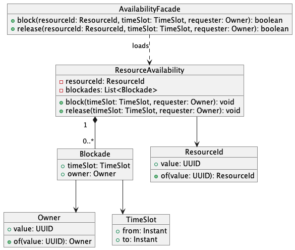

```java
class AvailabilityFacade {
    boolean block(ResourceId resourceId, TimeSlot timeSlot, Owner owner) {
        ResourceAvailability availability = loadResourceAvailability(resourceId);
        return availability.block(timeSlot, owner);
    }

    boolean release(ResourceId resourceId, TimeSlot timeSlot, Owner owner) {
        ResourceAvailability availability = loadResourceAvailability(resourceId);
        return availability.release(timeSlot, owner);
    }
}

class ResourceAvailability {
    ResourceId resourceId;
    List<Blockade> blockades;

    void block(TimeSlot timeSlot, Owner owner) {
        // ...
    }

    void release(TimeSlot timeSlot, Owner owner) {
        // ...
    }
}

record Blockade(TimeSlot timeSlot, Owner owner) {}
```

This approach reduces the impact of the previous solution's problems, but doesn't eliminate them entirely. Commands for different resources no longer block each other, but operations on the same resource still conflict even when targeting completely independent time periods. While adequate for low-traffic scenarios with occasional bookings, this approach becomes problematic for busy resources where users frequently attempt concurrent reservations

### Calendar per Resource per time period

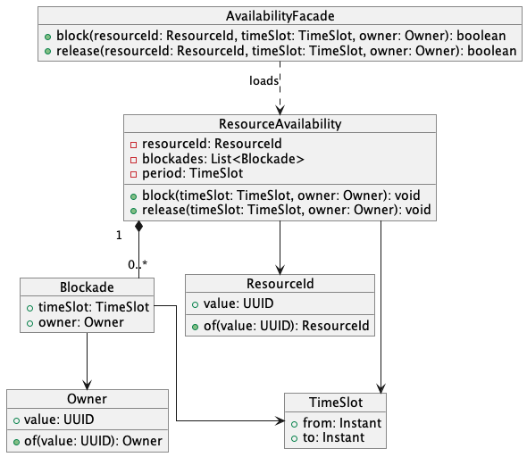

We can take this even further and partition each resource's availability into smaller, limited time frame:

```java
class ResourceAvailability {
    ResourceId resourceId;
    List<Blockade> blockades;
    TimeSlot slot;

    void block(TimeSlot timeslot, Owner owner) {
        // ...
    }

    void release(...) {
        // ..
    }
}

record Blockade(TimeSlot timeSlot, Owner owner) {};
```

This approach divides availability management into smaller time segments - weekly or monthly chunks. While this improves performance by loading only relevant time periods, it creates challenges around segment boundaries. When a reservation spans multiple segments, the system must load and coordinate several aggregates.

This solution may work well when the business has natural time boundaries - like quarterly periods. However, when resources can be blocked for unrestricted time ranges, the artificial time divisions create unnecessary conflicts and complexity.

## Solution

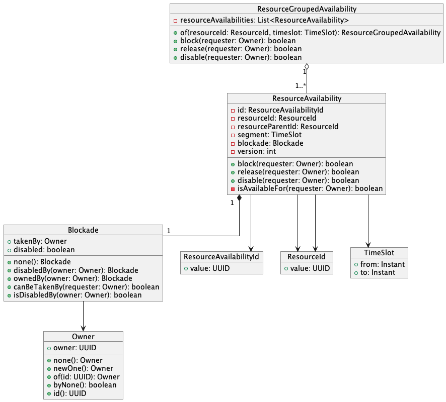

```java
class ResourceAvailability {
    private final ResourceAvailabilityId id;
    private final ResourceId resourceId;
    private final ResourceId resourceParentId;
    private final TimeSlot segment;
    private Blockade blockade;
    private int version = 0;

    boolean block(Owner requester) {
        if (isAvailableFor(requester)) {
            blockade = Blockade.ownedBy(requester);
            return true;
        }
        return false;
    }

    boolean release(Owner requester) {
        if (isAvailableFor(requester)) {
            blockade = Blockade.none();
            return true;
        }
        return false;
    }

    boolean disable(Owner requester) {
        this.blockade = Blockade.disabledBy(requester);
        return true;
    }

    private boolean isAvailableFor(Owner requester) {
        return blockade.canBeTakenBy(requester) && !isDisabled();
    }
}
```

Each `ResourceAvailability` represents a time segment for a specific resource. Rather than managing entire calendars, the system works with these micro-units that can be dynamically composed into larger ones.

**Key benefits:**

- **Minimal data loading**: Only exact time segments needed for each operation are loaded
- **Fine-grained locking**: Operations on the same resource but different time periods conflicts only when time slots overlap

## How it works

### Blockade

Blockade encapsulates all state information about a resource's availability:

```java
record Blockade(Owner takenBy, boolean disabled) {
    static Blockade none() {
        return new Blockade(Owner.none(), false);
    }

    public static Blockade disabledBy(Owner owner) {
        return new Blockade(owner, true);
    }

    public static Blockade ownedBy(Owner owner) {
        return new Blockade(owner, false);
    }

    boolean canBeTakenBy(Owner requester) {
        return takenBy.byNone() || takenBy.equals(requester);
    }

    boolean isDisabledBy(Owner owner) {
        return disabled && owner.equals(this.takenBy);
    }
}

public record Owner(UUID owner) {

    static Owner none() {
        return new Owner(null);
    }

    public static Owner newOne() {
        return new Owner(UUID.randomUUID());
    }

    public static Owner of(UUID id) {
        return new Owner(id);
    }

    public boolean byNone() {
        return none().equals(this);
    }

    public UUID id() {
        return owner;
    }
}
```

This creates three distinct states:

- Available: `Blockade.none()` - can be blocked by anyone
- Blocked: `Blockade.ownedBy(owner)` - reserved by specific owner
- Disabled: `Blockade.disabledBy(owner)` - unavailable eg. for maintenance purposes

#### State Transition Rules

There are rules governing who and when can perform which operations:

##### Disabling:

- ✅ Any resource can be disabled anytime
- ✅ Only the original disabler can re-enable the resource

##### Blocking:

- ✅ Resource without blockade can be blocked by anyone
- ❌ Already blocked resource cannot be blocked by someone else
- ❌ Disabled resource cannot be blocked by anyone (including the disabler)

##### Releasing:

- ✅ Resource can only be released by current blockade owner
- ❌ Someone else cannot release a resource they don't own

### Preventing Time Slots Overlapping

The key to achieving a scalable and safe solution is preventing the creation of overlapping slots and locking only conflicting operations at the database layer. The simplest approach is using GIST database indexes, which handle overlap prevention directly at the database level. However, among most popular databases, only PostgreSQL supports this feature well enough. If PostgreSQL is not available in your stack, you'll need to implement time slot normalization and segmentation.

#### 1. Database-Level GIST Index

Using PostgreSQL's `tsrange` and GIST indexes, availability schema looks like this:

```sql
create table if not exists availabilities (
    id uuid not null,
    resource_id uuid not null,
    resource_parent_id uuid,
    version bigserial not null,
    time_slot tsrange not null,
    taken_by uuid,
    disabled boolean not null default false,
    primary key (id),
    exclude using gist (
        resource_id with =,
        time_slot with &&
    )
);

create index idx_resource_availabilities on availabilities using gist (resource_id, time_slot);
```

What does this give us?

1. No normalization required – The `EXCLUDE` constraint automatically prevents inserting overlapping time slots for the same resource, eliminating the need for application-level normalization logic.

2. Easy and Efficient overlap detection – Finding conflicting time slots is straightforward using the overlap operator (&&):

```sql
SELECT *
FROM availabilities
WHERE resource_id = :resource_id AND time_slot && tsrange(:time_from, :time_to);
```

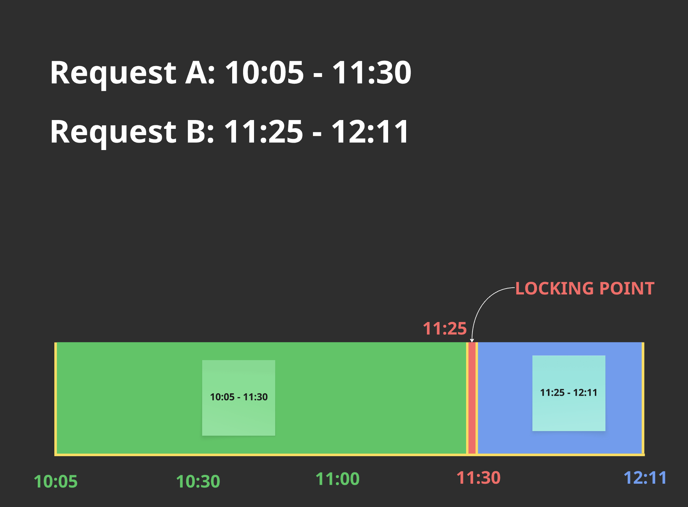

#### 2. Normalization & Segmentation

Database schema with the segmentation-based solution would look like this:

```sql
create table if not exists availabilities (
    id uuid not null,
    resource_id uuid not null,
    resource_parent_id uuid,
    version bigserial not null,
    from_date timestamp not null,
    to_date timestamp not null,
    taken_by uuid,
    disabled boolean not null,
    primary key (id),
    unique(resource_id, from_date, to_date));
```

If we try to instert two availabilities with differing from_date or to_date which overlaps, database won't detect conflict. That's why we need to normalize and segment our time slots

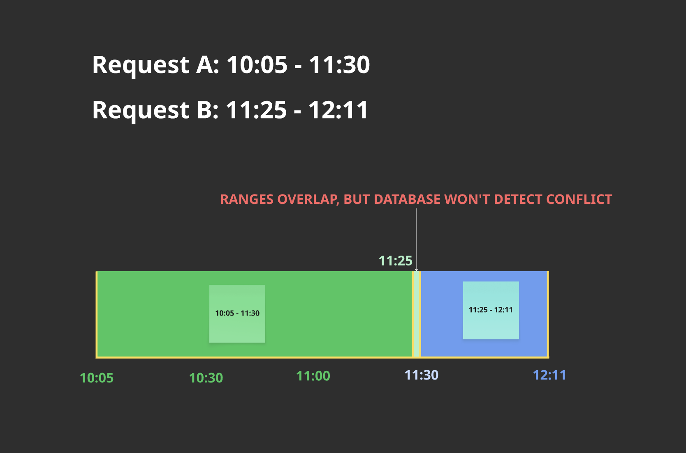

##### Time slot normalization

When clients request time ranges that don't align with segment boundaries, they are automatically normalized:

```java
class SlotToNormalizedSlot implements BiFunction<TimeSlot, SegmentInMinutes, TimeSlot> {

    @Override
    public TimeSlot apply(TimeSlot timeSlot, SegmentInMinutes segmentInMinutes) {

        int segmentInMinutesDuration = segmentInMinutes.value();
        Instant segmentStart = normalizeStart(timeSlot.from(), segmentInMinutesDuration);
        Instant segmentEnd = normalizeEnd(timeSlot.to(), segmentInMinutesDuration);
        TimeSlot normalized = new TimeSlot(segmentStart, segmentEnd);
        TimeSlot minimalSegment = new TimeSlot(segmentStart, segmentStart.plus(segmentInMinutes.value(), ChronoUnit.MINUTES));
        if (normalized.within(minimalSegment)) {
            return minimalSegment;
        }
        return normalized;
    }

    private Instant normalizeEnd(Instant initialEnd, int segmentInMinutesDuration) {
        Instant closestSegmentEnd = initialEnd.truncatedTo(ChronoUnit.HOURS);
        while (initialEnd.isAfter(closestSegmentEnd)) {
            closestSegmentEnd = closestSegmentEnd.plus(segmentInMinutesDuration, ChronoUnit.MINUTES);
        }
        return closestSegmentEnd;
    }

    private Instant normalizeStart(Instant initialStart, int segmentInMinutesDuration) {
        Instant closestSegmentStart = initialStart.truncatedTo(ChronoUnit.HOURS);
        if (closestSegmentStart.plus(segmentInMinutesDuration, ChronoUnit.MINUTES).isAfter(initialStart)) {
            return closestSegmentStart;
        }
        while (closestSegmentStart.isBefore(initialStart)) {
            closestSegmentStart = closestSegmentStart.plus(segmentInMinutesDuration, ChronoUnit.MINUTES);
        }
        return closestSegmentStart;
    }
}
```

```java
    // Client request: 00:10 to 01:00 with 90-minute segments
    TimeSlot request = new TimeSlot("2023-09-09T00:10:00Z", "2023-09-09T01:00:00Z");
    TimeSlot normalized = Segments.normalizeToSegmentBoundaries(request, SegmentInMinutes.of(90));

    // Result: 00:00 to 01:30 (expanded to segment boundaries)
    assertEquals("2023-09-09T00:00:00Z", normalized.from());
    assertEquals("2023-09-09T01:30:00Z", normalized.to());
```

This normalization ensures that two overlapping requests - even if they ask for different time ranges - will compete for the same underlying segments.

##### Segment Splitting

For larger time slots, they are split into multiple segments:

```java
class SlotToSegments implements BiFunction<TimeSlot, SegmentInMinutes, List<TimeSlot>> {

    @Override
    public List<TimeSlot> apply(TimeSlot timeSlot, SegmentInMinutes duration) {
        TimeSlot minimalSegment = new TimeSlot(timeSlot.from(), timeSlot.from().plus(duration.value(), ChronoUnit.MINUTES));
        if (timeSlot.within(minimalSegment)) {
            return List.of(minimalSegment);
        }
        int segmentInMinutesDuration = duration.value();
        long numberOfSegments = calculateNumberOfSegments(timeSlot, segmentInMinutesDuration);
        return Stream
                .iterate(timeSlot.from(), currentStart -> currentStart.plus(segmentInMinutesDuration, ChronoUnit.MINUTES))
                .limit(numberOfSegments)
                .map(currentStart -> new TimeSlot(currentStart, calculateEnd(segmentInMinutesDuration, currentStart, timeSlot.to())))
                .toList();
    }

    private long calculateNumberOfSegments(TimeSlot timeSlot, int segmentInMinutesDuration) {
        return (long) Math.ceil((double) Duration.between(timeSlot.from(), timeSlot.to()).toMinutes() / segmentInMinutesDuration);
    }

    private Instant calculateEnd(int segmentInMinutesDuration, Instant currentStart, Instant initialEnd) {
        Instant segmentEnd = currentStart.plus(segmentInMinutesDuration, ChronoUnit.MINUTES);
        if (initialEnd.isBefore(segmentEnd)) {
            return initialEnd;
        }
        return segmentEnd;
    }
}
```

```java
    // 1-hour request with 15-minute segments
    TimeSlot oneHour = new TimeSlot("2023-09-09T00:00:00Z", "2023-09-09T01:00:00Z");
    List<TimeSlot> segments = Segments.split(oneHour, SegmentInMinutes.of(15));

    // Result: 4 segments of 15 minutes each
    // 00:00-00:15, 00:15-00:30, 00:30-00:45, 00:45-01:00
```

Each segment becomes a separate `ResourceAvailability` in the database. To block the entire hour, all 4 segments must be available and will be locked together in a single transaction.

```java
  class ResourceGroupedAvailability {

    private final List<ResourceAvailability> resourceAvailabilities;

    ResourceGroupedAvailability(List<ResourceAvailability> resourceAvailabilities) {
        this.resourceAvailabilities = resourceAvailabilities;
    }

    static ResourceGroupedAvailability of(ResourceId resourceId, TimeSlot timeslot) {
        List<ResourceAvailability> resourceAvailabilities = Segments
                .split(timeslot, SegmentInMinutes.defaultSegment())
                .stream()
                .map(segment -> new ResourceAvailability(ResourceAvailabilityId.newOne(), resourceId, segment))
                .toList();
        return new ResourceGroupedAvailability(resourceAvailabilities);
    }

    // ...
}
```

##### Example

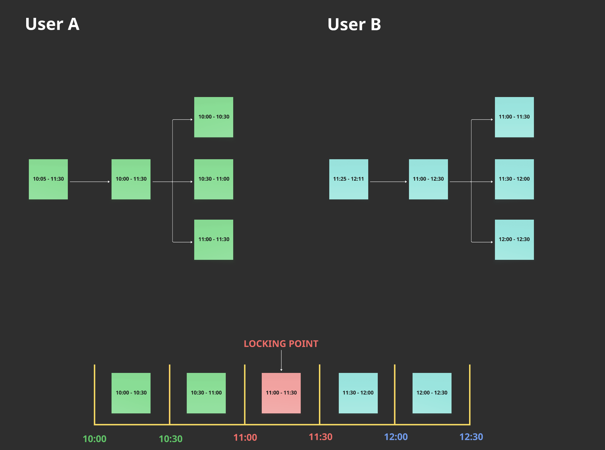

Consider two reservation requests that barely overlap:

User A: "Book meeting room from 10:05 to 11:30"
User B: "Book meeting room from 11:25 to 12:11"

These requests overlap by 5 minutes (11:25-11:30), but without proper coordination, both could succeed and create a conflict.
With 30-minute segments, both requests are normalized:

User A: 10:00-11:30
User B: 11:00-12:30

And then they are split into smaller segments:

User A: 10:00-10:30, 10:30-11:00, **11:00-11:30**
User B: **11:00-11:30**, 11:30-12:00, 12:00-12:30

Both requests now compete for the one overlapping segment: **11:00-11:30**. Even though their original requests overlapped by only 5 minutes, the normalization ensures they conflict on well-defined database record.
This segmentation happens transparently - clients work with natural time ranges while the system ensures data consistency through standardized internal boundaries.

### Displaying user-friendly calendar

While micro-segments are used internally for optimal performance and conflict resolution, users need a clean, consolidated view of availability. The read model addresses this by aggregating the fragmented micro-segments back into meaningful time periods.

Imagine building short-term rental system.

Our operational model stores availability as 4h segments:

**Apartment X - January 2025:**

Jan 1 00:00-04:00 → Available
Jan 1 04:00-08:00 → Available
...
Jan 3 08:00-12:00 → Available
Jan 3 12:00-16:00 → Maintenence
Jan 3 16:00-20:00 → John Smith
...
Jan 7 08:00-12:00 → John Smith
Jan 7 12:00-16:00 → Maintenence
Jan 7 16:00-20:00 → Alice Johnson
...
Jan 13 08:00-12:00 → Alice Johnson
Jan 13 12:00-16:00 → Maintenence
Jan 13 16:00-20:00 → Available
...
Jan 31 20:00 - Feb 1 00:00 → Available

But users expect to see consolidated periods:

Jan 1 00:00 - Jan 3 12:00 → Available
Jan 3 12:00 - Jan 3 16:00 → Maintenence
Jan 3 16:00 - Jan 7 12:00 → John Smith
Jan 7 12:00 - Jan 7 16:00 → Maintenence
Jan 7 16:00 - Jan 13 12:00 → Alice Johnson
Jan 13 12:00 - Jan 13 16:00 → Maintenence
Jan 13 16:00 - Feb 1 00:00 → Available

The read model uses a sophisticated SQL query to merge adjacent segments with the same owner:

```sql
    WITH AvailabilityWithLag AS (
        SELECT resource_id, taken_by, from_date, to_date,
            LAG(to_date) OVER (PARTITION BY resource_id, taken_by ORDER BY from_date) AS prev_to_date
        FROM availabilities
        WHERE from_date >= ? AND to_date <= ? AND resource_id = ANY (?)
    ),
    GroupedAvailability AS (
        SELECT *,
            CASE WHEN from_date = prev_to_date THEN 0 ELSE 1 END AS new_group_flag,
            SUM(CASE WHEN from_date = prev_to_date THEN 0 ELSE 1 END)
            OVER (PARTITION BY resource_id, taken_by ORDER BY from_date) AS grp
        FROM AvailabilityWithLag
    )
    SELECT resource_id, taken_by,
        MIN(from_date) AS start_date,
        MAX(to_date) AS end_date
    FROM GroupedAvailability
    GROUP BY resource_id, taken_by, grp
    ORDER BY start_date
```

The result is organized in the following structure:

```java
public record Calendar(ResourceId resourceId, Map<Owner, List<TimeSlot>> calendar) {

    public List<TimeSlot> availableSlots() {
        return calendar.getOrDefault(Owner.none(), List.of());
    }

    public List<TimeSlot> takenBy(Owner requester) {
        return calendar.getOrDefault(requester, List.of());
    }
}
```

- **Available periods** are represented by Owner.none()
- **Blocked periods** are grouped by the owner who blocked them

Frontend team can utilize this read model to provide an intuitive calendar interface. Provided structure allows for flexible rendering across different view modes and filtering options:

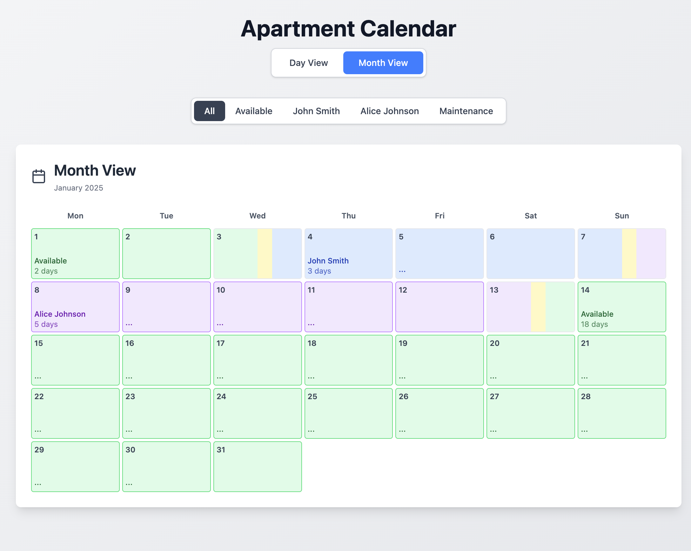
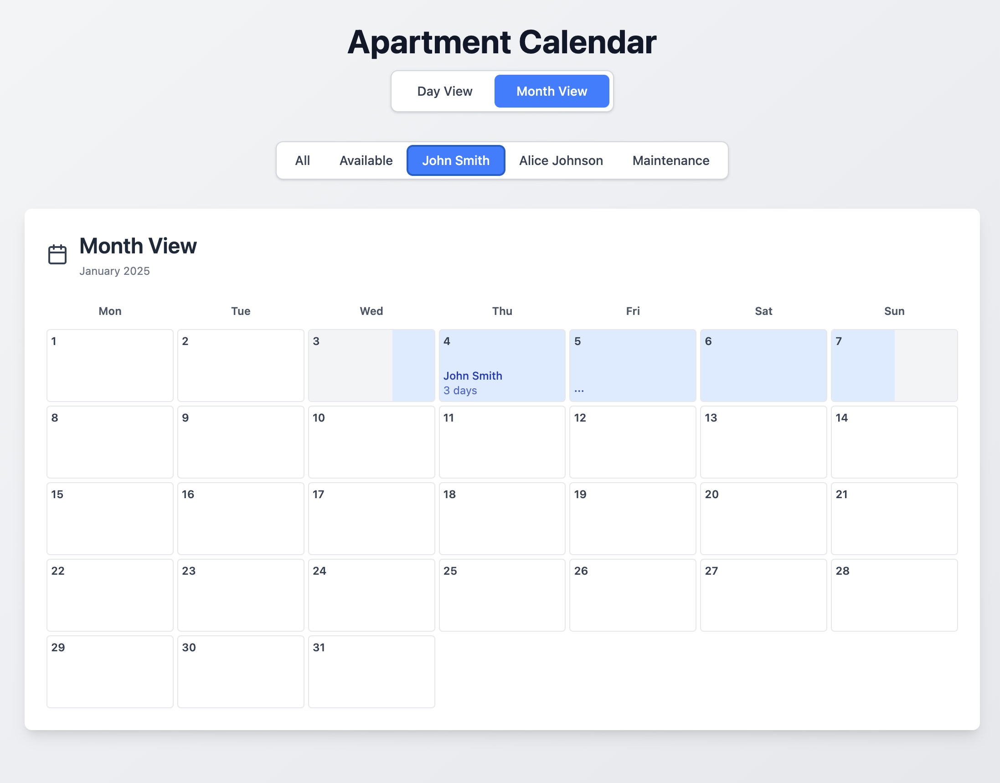
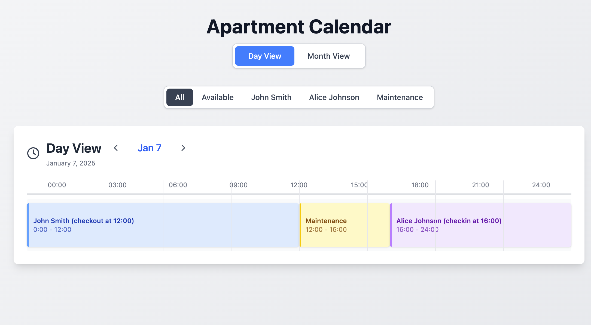

Interactive version: https://68ebc702cd4867451789a9d8--availability-archetype-calendar.netlify.app
