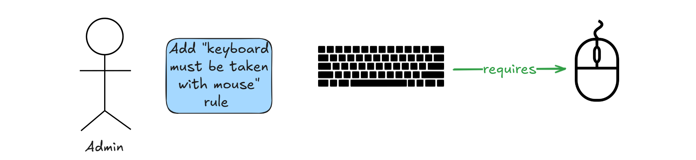
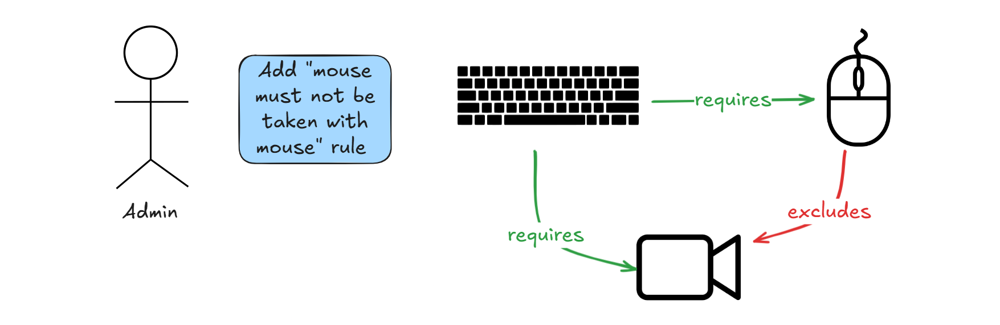
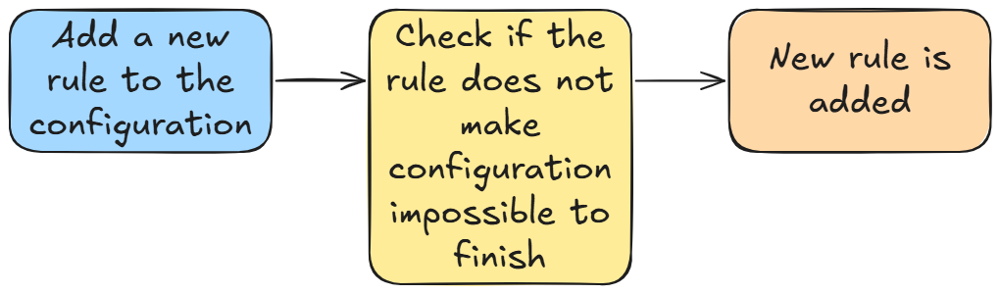
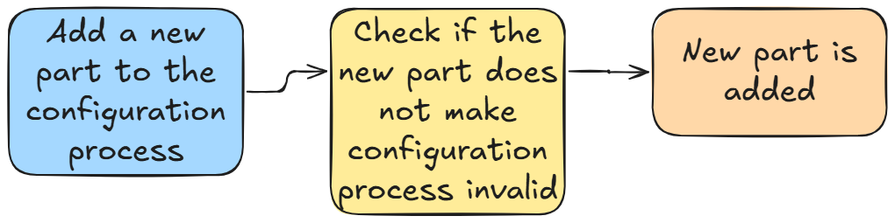
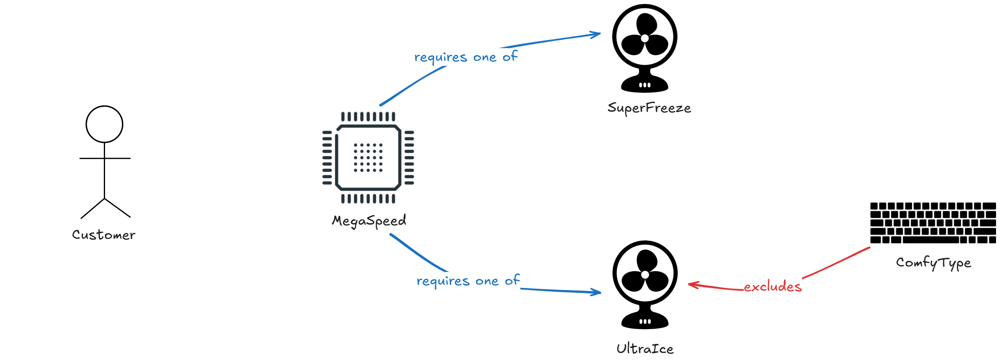
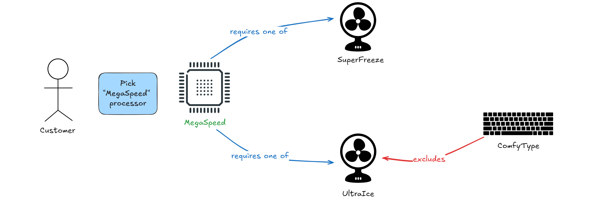

# Configurator archetype pattern

## Problem statement

### Level 1

Have you ever bought a car? Well, that is not so common - but maybe you decided to purchase a shiny, new, high-end computer?
If you are not an expert that process can induce a serious headache - wanna add backlit keyboard? Here you are,
but it is possible only with thousand threaded processor. Maybe black color is something to land on? Surely,
but it comes along with way more expensive matte screen and case! How they say - the more options on the table the harder decision to make.
These tricks are there to fetch more money from clients. From merchant perspective to achieve this ultimate goal proper set of viable
configurations has to be created.

### Level 2

However, conditional inclusion `(if you choose backlit keyboard then thousand thread processor must be taken)` is not the only possible relation.
There is a need to ensure that only keyboard might be taken at a moment `(if you choose backlit keyboard,
then usual keyboard and mechanical keyboards cannot be taken)`. Sometimes picking more demanding option requires technical compensation to not
break your device, but there are `(if you choose super fast processor then one of several appropriate cooling systems must be taken)`,
however still, you cannot have more than one cooling system at a time. Of course many of these rules are applicable in parallel,
which means a lot of indirect dependencies and cascading consequences of decisions `(if black color then faster processor must be taken and if
faster processor then one of additional cooling systems must be taken)`.
What is more - rules tend to change pretty quickly - in ever-evolving, competition world merchants need to continuosly
extend their offer with trendy colors and designs, quieter keyboards, better graphic cards and etc.

### Level 3

No matter how much sellers try to rip buyers off they still want to provide seamless purchase process.
Let's imagine spending many hours on configuring computer and finding out at the time of submit that set is not valid and majority
of items that have been picked are not available. Of course, we can enhance it and inform that configuration is invalid as soon as
new part is picked, nonetheless it still might end up trying to blindly guess which actual part is needed.
Therefore one step further can be taken - system could assist the user and lead they by hand, autosuggest what are needed options to fullfill all requirments, tell explicitly what is needed and block options that are excluded by rules in duty.

### Level 4

Not only customers might hurt themselves during complex configuration processes - crafting one from scratch quite a challenge for business personas. Imagine there are thousands of rules already and administrator wants to add another one.
It is impossible to iterate over each rule and check if new condition will not cause any conflicts and as a result - will disallow client to finish process smoothly.
System needs to be designed in a robust way that detects contradicting rules preliminarly and guards against breaking customer journey.

Let's see how aformentioned problems could be tackled with several approaches.

## Use cases

Based on problem statements from the beginning four major use cases might be identified: 

1. Setting up configuration rules as an admin
2. Adding or removing parts during configuration process as a customer
3. Blocking or suggesting parts for customer during configuration process as a system
4. Completing configuration process as a customer

### Use case #1 - Setting up configuration rules as an admin

At first we need to define what kind of rules come into play. The most trivial ones are of course the following:

- if part A is added then part B cannot be excluded (single exclusion rule)
- if part C is added then part D must be included (single inclusion rule)

But sometimes adding e.g. processor with more power means that one of several additional coolers should be included - however it does not neccesserly forces particular choice. 
Same with excludance - if one web camera is already chosen then any other processor cannot be picked! Deducing from that the following rules can be formed:

- if part E is added then part F and G and H and... cannot be included (this is an equvialent of many single exclusion rules)
- if part A is added then part B or C or D or... must be included (one of inclusion rule)

But hey! Do not sleep on fundamentals! For each computer some processor, RAM memory, keyboard and other basic staff must be chosen - thing couldn't even be named computer without them! Hence additional rule category is identified:

- one of parts E,F,G,... must be always present (presence rule)

Take a notice that this rule allows admin to force picking single part always - just instead of collection single value can be used.
To sum things up there are four types of rules that allows for creating whatever configuration one could have imagined:

- single exclusion rule
- single inclusion rule
- one of inclusion rule
- presence rule

But - as always - complexity lies in details. How to ensure that they are not interfering with each other making the configuration impossible to finish? That's the hard part, if admin slips there the whole purchase of product will not be completable, so customers won't be able to buy anything. That smells badly - like a lot of money lost.

#### *Scenario with configuration impossible to complete*

##### Step 1

##### Step 2

##### Step 3


**In the scenario above no matter how hard one will try there is now way to configure a computer with keyboard!**

#### Use case #1 diagram

So as it might be seen - system should prevent admin from boxing customer in a corner.
Visualization of this use case looks as following - admin adds a new rule, system checks if at least one set of parts that meets all rules defined in the configuration exists - and if yes new rule is successfully added.



### Use case #2 - Adding or removing parts during configuration process as a customer

Let's assume that admin has already done their job and set up configuration properly - end users are finally able to start playing with possible options to buy their dreamed machine.
In simple words - they can finally start *configuration process*.
Before jumping into any solutions let's distinguish two crucial concepts of configuration process being `Valid` and `Completed`.

If configuration process is `Completed` it means that all rules regarding product are satisfied and it can be purchased. On the other side,
`Valid` configuration process does not mean that all rules are met, it just means they are not in conflict, but still picking proper parts may lead to `Completing` the process.
To highlight difference let's work on the following example:

```
There are three rules: 
1. Any processor must be taken
2. If processor MegaSpeed is taken then cooler SuperFreeze must be taken
3. If cooler SuperFreeze is taken then cooler UltraIce cannot be taken

Following sets are possible having such intial conditions: 
|         Picked items              | IsValid | IsCompleted |
|-----------------------------------|---------|-------------|
| None                              |   Yes   |     No      |
| MegaSpeed                         |   Yes   |     No      |
| UltraIce                          |   Yes   |     No      |
| SuperFreeze                       |   Yes   |     No      |
| MegaSpeed, SuperFreeze            |   Yes   |     Yes     |
| MegaSpeed, UltraIce               |    No   |     No      | -- indirect exclusion, there is no way of completing such a configuration without removing MegaSpeed
| SuperFreeze, UltraIce             |    No   |     No      |
| MegaSpeed, SuperFreeze, UltraIce  |    No   |     No      |
```

So after delving into meandrs of configuring processes it is clear that system needs to guard against customer boxing themselves into the corner - end users do not know all rules and even if they do, this would have nothing in common with seamless user experience.

#### Use case #2 diagram



### Use case #3 - Blocking or suggesting parts for customer during configuration process as a system

However, as pointed out in the beginning, customer might be led by hand by system. Two enhancements were identified to do so:

- If there is a part that is unambiguously needed to be picked, because otherwise configuration will not ever be completed system could suggest it automatically to make things easier - sooner or later customer would be forced to pick it anyway.
- If there is a part which peaking will lead to make configuration process invalid it can be blocked at the time of picking another part, which causes this exclusion. There is no point in customer trying to blindly pick what they thinks is needed and learning that their choice is not possible due to rules contradiction.

#### Auto-suggestion scenario

Let's assume there are two rules:

1. If processor MegaSpeed is taken then one of coolers SuperFreeze or UltraIce must be taken
2. If keyboard ComfyType is taken then cooler UltraIce cannot be taken

The scenario might look like followed then!




## Possible solutions

Before jumping into any solutions let's distinguish two crucial concepts configuration being `Valid` and `Completed`. 

If configuration is `Completed` it means that all rules regarding product are satisfied and it can be purchased. On the other side, `Valid` configuration does not mean that all rules are met, it just means they are not in conflict. To highlight difference let's work on the following example:

```
There are three rules: 
1. Any processor must be taken
2. If processor MegaSpeed is taken then cooler SuperFreeze must be taken
3. If cooler SuperFreeze is taken then cooler UltraIce cannot be taken

Following sets are possible having such intial conditions: 
|         Picked items              | IsValid | IsCompleted |
|-----------------------------------|---------|-------------|
| None                              |   Yes   |     No      |
| MegaSpeed                         |   Yes   |     No      |
| UltraIce                          |   Yes   |     No      |
| SuperFreeze                       |   Yes   |     No      |
| MegaSpeed, SuperFreeze            |   Yes   |     Yes     |
| MegaSpeed, UltraIce               |    No   |     No      | -- indirect exclusion, there is no way of completing such a configuration without removing MegaSpeed
| SuperFreeze, UltraIce             |    No   |     No      |
| MegaSpeed, SuperFreeze, UltraIce  |    No   |     No      |
```

Knowing basic Domain Driven Design principles one might want to adhere to well known principle of Ubiquitous Language. There is Computer Configuration with Computer Parts, each Computer Part has a list of parts that are excluded or required (for simplicty sake's let strip off `one of many must be taken`). Configuration might be valid or not and voila:

```java
class ComputerPart {
    private String name;
    private String type;
    private List<ComputerPart> excludedParts = new ArrayList<>();
    private List<ComputerPart> requiredParts = new ArrayList<>();

    // Add a required part
    // Add an excluded part
}

class ComputerConfiguration {
    private int userId;
    private List<ComputerPart> pickedParts = new ArrayList<>();

    public boolean allRequirementsAreFullfilled() {
        for (ComputerPart pickedPart : pickedParts) {
            for (ComputerPart excludedPart : pickedPart.getExcludedParts()) {
                if (pickedParts.contains(excludedPart)) {
                    return false;
                }
            }

            for (ComputerPart requiredPart : pickedPart.getRequiredParts()) {
                if (!pickedParts.contains(requiredPart)) {
                    return false;
                }
            }
        }
        return true;
    }

    // Add a picked part
}
```

At first glance looks like it all went pretty smooth - however many questions remain unanswered with the aformentioned design:
* it can check whether end configuration fulfills all requirements in absolute terms, though it cannot check whether configuration is `valid` or not. `Valid` configuration might still be incomplete